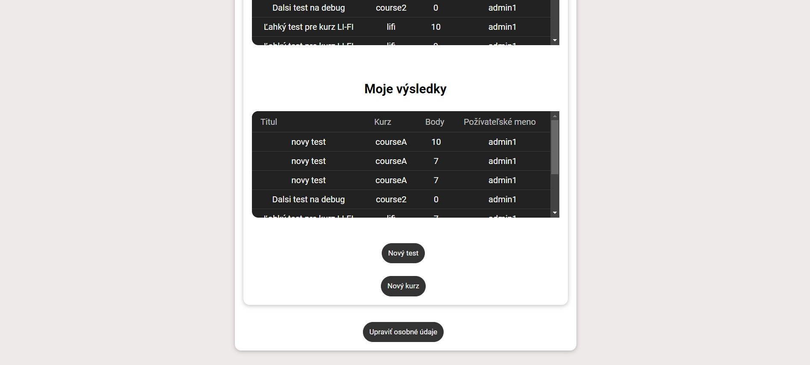

# ASOS-Online_Learning_Platform

## Prerequisites
Before you begin, ensure you have the following prerequisites installed:

- [XAMPP](https://www.apachefriends.org/index.html) (with PHP 8.2) for setting up the backend environment.
- [MariaDB](https://mariadb.org/) (10.6) for the database.
- [Node.js](https://nodejs.org/en) for the frontend.

## Getting Started

1. Clone this repository to your local machine to the XAMPP's htdocs directory (usually located at C:\xampp\htdocs on Windows or /opt/lampp/htdocs on Linux).

   Configure the necessary settings in XAMPP to run the backend if needed.


2. Start XAMPP and ensure that the Apache services is running.


3. Start MariaDB service.


4. Create the MariaDB database using the **olp_database.sql** file provided in the SQL folder of the project. You can use a tool like phpMyAdmin, HeidiSQL or the MariaDB command line.


5. Install the necessary dependencies for the frontend (Vue.js). Navigate to the project directory (ASOS-Online_Learning_Platform) and run:
   ```
   npm install
   ```
6. Start the frontend development server by running the following command in the project directory (ASOS-Online_Learning_Platform):
   ```
   npm run serve
   ```
7. Your web application should now be accessible at http://localhost:8080 in your web browser.

   Default users in database:
   
   Role | Email | Password |
   --- | --- | --- |
   admin | admin1@admin.com| admin1 |
   teacher | teacher1@teacher.com | newpassword |
   student | student1@student.com | newpassword |

## Web Application User Manual

### Home Screen
The home screen features a scrollable list of pre-prepared courses. Clicking on a course name displays the respective course. The top bar serves as navigation, allowing you to access other pages.

<div align="center">
    
</div>

Hovering over the "Kurzy" (Courses) heading displays a dropdown with topics. Clicking on a topic displays the corresponding course.

The page adapts to the screen width. If the headings no longer fit on the top bar, a hamburger menu (three lines) appears in the navigation bar. Clicking it expands a vertical navigation menu.

<div align="center">
    
</div>

### Registration Screen
On this screen, you can sign up and select the role of either student or teacher. If any information is invalid, an error message appears next to the problematic field. After successful registration, the system redirects you to the login page.

<div align="center">
    
</div>

### Login Screen
Registered users can log in on this screen.

<div align="center">
    
</div>

### Logged-in Home Screen
For logged-in users, a logout button is available in the top right corner. If a user has a teacher role, a link to the teacher page appears in the top navigation bar. If a user is an administrator, both "Teacher" (“Učiteľ”) and "Admin" links appear in the navigation bar, allowing access to the respective pages.

<div align="center">
    
</div>

### Course Page
The current page displays samples of text courses. The course is at the top of the page, and a list of corresponding tests is at the bottom. You can start a test by pressing the "Test" button in the buttom of the page at the test list.

<div align="center">
    
</div>

### Test Screen
All questions and their answers are displayed simultaneously on the test screen. Each question has only one correct answer.

<div align="center">
    
</div>

Pressing the "Vyhodnotiť" ("Evaluate") button displays the test's score.

### Student Page
On the student page, you can view all results of the logged-in student.

<div align="center">
    
</div>

### Teacher Page
This page displays a list of the teacher's tests, where tests can be edited and deleted. Below that are the results of all their tests and the results of tests taken by the teacher.
<div align="center">
    
</div>
<div align="center">
    
</div>

Pressing the "Nový test" ("New Test") button displays a form where you can enter the test name, select the course it belongs to, and input questions, answers, and the correct answer.

Pressing the "Nový kurz" ("New Course") button displays a form where you can create a new suggested course. New courses are created by administrators.

### Administrator Page
On this page, you can manage all users of the system and view, edit, and delete all tests. Below that are the results of all tests. There is a form to add users with all roles. At the bottom of the page, there is a list of suggested new courses. 